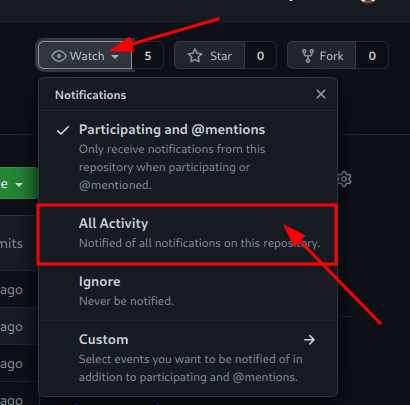
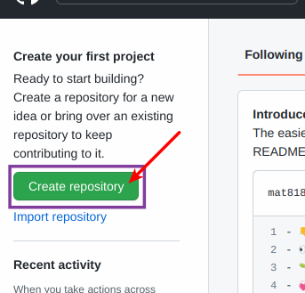
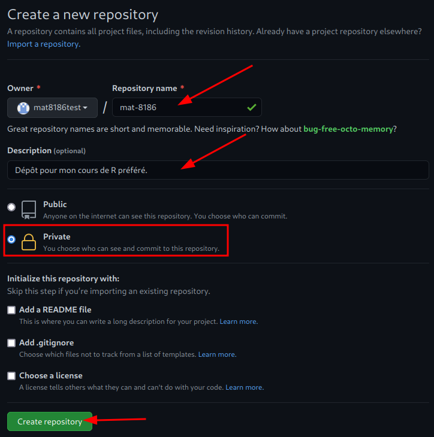
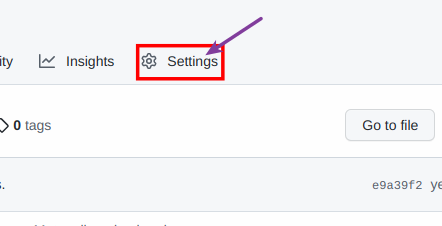
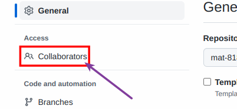
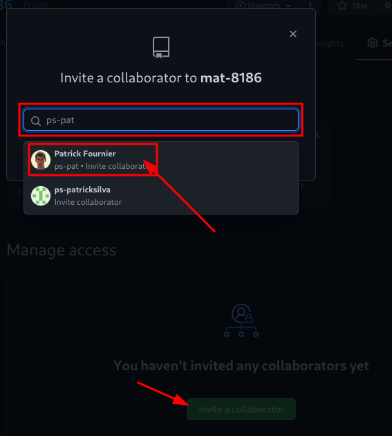

[](https://mybinder.org/v2/gh/cours-patrickFournier/mat8186-r-avance/9ff15bd64a7dce9b0472f8e19f37b82cf12ccd36?filepath=1-introduction%2Findex.ipynb)
[](https://mybinder.org/v2/gh/cours-patrickFournier/mat8186-r-avance/9ff15bd64a7dce9b0472f8e19f37b82cf12ccd36?filepath=2-Fondations%2Findex.ipynb)
[](https://adv-r.hadley.nz/)
[](https://adv-r.hadley.nz/)
[](https://adv-r.hadley.nz/)
[](https://adv-r.hadley.nz/)
[](https://adv-r.hadley.nz/)
[](https://adv-r.hadley.nz/)

# MAT8186: Techniques avancées en programmation statistiques R
## Bienvenue!
Tout d'abord, je vous souhaite la bienvenue sur le dépôt GitHub de
votre cours. Vous y trouverez:
* Slides de chacun des cours.
* Devoirs.
* Liens utiles / matériel supplémentaire.

Veuillez noter que nous n'utiliserons *pas* Moodle pour ce cours; *le
dépôt contiendra donc l'ensemble du matériel nécessaire*.

## Informations
* [Horaire](https://etudier.uqam.ca/cours?sigle=MAT8186): de 10h00 à 12h00 le
  * mercredi: 8, 15, 22 et 29 septembre
  * lundi: 13, 20 et 27 septembre, 4 octobre
* [Emplacement](https://goo.gl/maps/qBEwa3xAaQB4keiY9): PK-S1545
   * Il s'agit d'un laboratoire d'informatique; des ordinateurs avec RStudio seront disponibles pour tous. Toutefois, je vous encourage à apporter votre propre ordinateur si vous préférez.

## Devoirs
À venir :cold_sweat:

## Coordonnées
Vous pouvez me joindre:
* par e-mail: fournier.patrick@uqam.ca
* Zoom: https://uqam.zoom.us/my/patrick.fournier
* en personne: PK-5323.

Vous ne devriez *pas* me contacter directement pour poser une question d'intérêt
général (exemple: "comment fait-on `xyz` dans R"). Pour ce type de questions,
utilisez plutôt le [forum du
cours](https://github.com/orgs/cours-patrickFournier/teams/automne-2021/discussions).
Tel que discuté, des points seront offerts pour toute réponse (correcte) que
vous fournirez à une question du forum.

## Références
Références principales:
* [Advanced R (Hadley Wickham)](https://adv-r.hadley.nz/)
* [Writing R Extensions (R Core Team)](https://cran.r-project.org/doc/manuals/r-release/R-exts.html)
* [R FAQ (Kurt Hornik)](https://cran.r-project.org/doc/FAQ/R-FAQ.html)
* [Git Reference (Scott Chacon et contributeurs du dépôt git-scm.com)](https://git-scm.com/docs)

Autres références disponibles sur demande.

## Logiciels à installer
Les logiciels suivants sont nécessaires pour le cours.
* [R (>= 4.1.1)](https://mirror.rcg.sfu.ca/mirror/CRAN/)
* [Git (>= 2.33.0)](https://git-scm.com/downloads)

*Si vous utilisez Windows*, vous devez installer [Git for Windows](https://gitforwindows.org/)

Si vous possédez déjà ces logiciels, profitez du début de la session pour vous
assurer qu'ils sont bien à jour.

### IDE
Étant donné sa grande popularité, il existe une multitude d'environements
permettant de faciliter le développement sous R. Libre à vous d'utiliser celui
qui vous plaît (ou de ne pas en utiliser du tout). Personnellement, je
recommande les suivants:
* [R Studio](https://www.rstudio.com/)
* [Visual Studio Code](https://code.visualstudio.com/)
   * [Extension R](https://marketplace.visualstudio.com/items?itemName=Ikuyadeu.r)

### Git graphique
De la même manière, il existe une panoplie de logiciels offrant une interface
graphique à Git parmi lesquels R Studio et Visual Studio Code. Dans le cours, je ferai les manipulations à partir du terminal. Toutefois, je vous encourage à essayer d'autres interfaces si vous êtes curieux.

## Packages R à installer
Les packages ci-dessous sont nécessaires à l'exécution des scripts R présents
sur ce dépôt. Ils sont tous disponibles sur CRAN et peuvent donc être installés
par un simple appel à `install.packages`.
* devtools
* doParallel
* foreach
* magrittr
* microbenchmark
* proftools
* pryr
* roxygen2
* testthat

Si vous possédez déjà ces packages, profitez du début de la session pour vous
assurer qu'ils sont à jour. Pour ce faire, à l'intérieur d'une session R,
appellez

``` R
update.packages(ask = FALSE)
```

## Comment utiliser ce dépôt
La bonne utilisation de git et, dans une moindre mesure, GitHub, fait partie
intégrante du cours. Git est à la base un outil en ligne de commande possédant
une quantité impressionnante de fonctionnalité. Cette section vous liste les
étapes nécessaires à la bonne utilisation du dépôt pour le cours.

À la fin de cette section, vous aurez
1. une copie locale du dépôt qui sera en mesure de recevoir les
   changements que j'y apporterai et
2. une copie en ligne de votre dépôt local à laquelle j'aurai accès.


### Créez votre compte GitHub
Le processus est standard, vous devriez facilement y arriver.

### Générez une clé SSH
Suivez la procédure détaillée
[ici](https://docs.github.com/en/github/authenticating-to-github/connecting-to-github-with-ssh/generating-a-new-ssh-key-and-adding-it-to-the-ssh-agent),
sections "Generating a new SSH key" et "Adding your SSH key to the ssh-agent".

### Ajoutez votre clé à votre compte GitHub
Suivez la procédure détaillée [ici](https://docs.github.com/en/github/authenticating-to-github/connecting-to-github-with-ssh/adding-a-new-ssh-key-to-your-github-account).

### Surveillez le dépôt
Cette étape n'est pas nécessaire mais je vous recommande de surveiller
ce dépôt. Vous serez ainsi averti des modifications lui étant
apportés. Pour ce faire,
1. Cliquez sur le bouton `Watch` au coin supérieur droit de cette page;
   un menu déroulant apparaîtra.
2. Cliquez sur `All Activity`.



### Créez un nouveau dépôt privé
Sur la page principale de votre compte, cliquez sur le bouton
«Create repository».



Par la suite, donnez un nom et décrivez votre nouveau dépôt. N'oubliez pas
de le rendre privé!



### Dupliquez le dépôt
Cette étape a pour but de créer votre propre copie personnelle du
dépôt. Pour la suite du cours, *vous allez travailler exclusivement dans
cette copie*.

1. Clonez mon dépôt:
```bash
git clone --origin upstream https://github.com/cours-patrickFournier/mat8186-r-avance.git
cd mat8186-r-avance
```
2. Ajoutez votre dépôt GitHub comme remote:
```bash
git remote add origin git@github.com:<nom d'utilisateur>/<nom du dépôt>.git
```

3. Poussez vers votre dépôt:
```bash
git push --set-upstream origin automne2021
```

L'ensemble de la procédure devrait ressembler à ceci:
[](https://asciinema.org/a/433370)


Une fois cela fait, donnez-moi accès à votre dépôt en m'ajoutant comme
collaborateur.

1. Cliquez sur le bouton `Settings` au coin supérieur droit de la page
de *votre dépôt*.



2. Cliquez sur `Manage access` à gauche.



3. Cherchez mon nom d'utilisateur (ps-pat) et ajoutez-moi comme collaborateur.



### Triangular workflow
Retournez voir le schéma du début de la section. Remarquez que vous
intégrez les changements d'un dépôt ne vous appartenant pas tandis que
vous modifiez un dépôt vous appartenant. Cette utilisation asymétrique
de Git est connue sous le nom de Triangular workflow. Sachez que si
l'envie vous prenait de contribuer à un projet libre ou open source un
jour, il s'agit généralement du workflow employé.

### Interagir avec les différents dépôts
Tout au long du cours, vous aurez besoin d'accomplir trois opérations de base:
* Pull
* Commit
* Push

Il est possible d'effectuer ces trois opérations directement à partir
de RStudio.

#### `git pull`: incorporer les changements les plus récents
La première opération à maîtriser est connue sous le nom de `git
pull`. Elle correspond à la flèche 1 sur le schéma du début de la
section. En réalité, elle accomplit deux tâches:
1. Importer les changements distants (équivaut à `git fetch`).
2. Incorporer ces changements à votre dépôt local (équivaut à `git merge`).

**Important**: *Avant de procéder à un `git pull` il est essentiel de
vous assurer que vos changements locaux ont été commis (voir section
suivante). Dans le cas contraire, vous aurez droit à un message
d'erreur de la part de git.*

Dans le cadre du cours, vous aller presque toujours vouloir intégrer les changements apportés à mon dépôt au vôtre. Pour ce faire, utilisez la commande:
```bash
git pull upstream automne2021
```

#### `git commit`: commettre vos modifications locales
Cette opération est *toujours* préalable à la troisième opération,
`git push`. Conceptuellement, elle est quelque peu
abstraite. Toutefois, elle est relativement facile à réaliser en
général.

Il n'est pas possible de soumettre directement des changements
apportés à votre dépôt local vers votre dépôt distant. La *seule*
manière de modifier le dépôt distant est de lui intégrer une sorte de
«photo» d'un changement ou d'un ensemble de changements locaux. Dans
le jargon de Git, ces photos sont appelées commits et sont générés par
la commande `git commit`. Pour faire un commit, il faut tout d'abord préciser les fichiers que l'on souhaite inclure:
```bash
git add fichier1 fichier2 ...
```
On peut ensuite construire le commit comme tel en n'oubliant pas de l'accompagner d'un message court et pertinent:
```bash
git commit -m "Mon message court et pertinent."
```

#### `git push`: envoyer vos commit vers votre dépôt distant
Le `push` est l'opération qui consiste à envoyer vos commits vers
votre dépôt distant. Elle correspond à la flèche 2 dans le schéma du
début de la section. Il suffit d'entrer la commande:
```bash
git push
```

Si vous obtenez un message d'erreur, assurez-vous de pousser vers le bon remote:
```bash
git push --set-upstream origin automne2021
```

## Pour en savoir plus
Git est un logiciel immensément populaire pour lequel il existe une
quantité impressionnante de documentation et tutoriels. Si vous
rencontrez un problème ou que vous souhaitez en apprendre davantage,
je vous recommande vivement les liens suivants:
* https://happygitwithr.com/
* https://git-scm.com/doc
